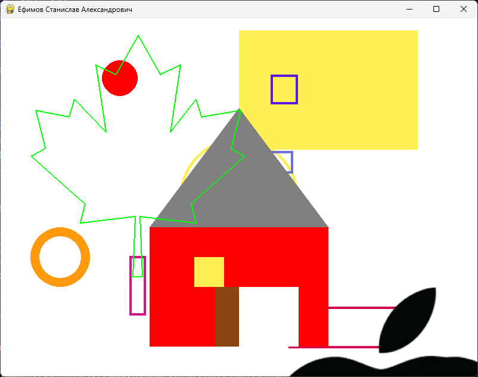

# Лабораторная работа 2: Pygame

## Упражнение 1: Основные принципы работы с pygame

В этом упражнении были реализованы базовые принципы работы с библиотекой Pygame. Программа демонстрирует различные возможности рисования и работы с графическим интерфейсом.

### Реализованные функции:
- Создание окна размером 800x600 с возможностью изменения размера
- Установка заголовка окна с ФИО
- Создание белого фона
- Рисование различных геометрических фигур:
  - Красный закрашенный круг
  - Оранжевый круг с контуром в третьей четверти
  - Желтый круг в центре экрана
  - Закрашенный прямоугольник
  - Пять случайных прямоугольников с случайными цветами
- Создание домика с крышей в центре экрана
- Создание произвольной фигуры из линий
- Работа с изображением (загрузка и перемещение)

### Результат:

## Упражнение 2: Анимация в pygame

В этом упражнении была реализована анимация различных геометрических фигур с использованием объектно-ориентированного подхода.

### Реализованные функции:
- Создание базового класса Shape для всех фигур
- Реализация классов для различных фигур:
  - Square (квадрат)
  - Rectangle (прямоугольник)
  - Circle (круг)
  - Triangle (треугольник)
- Реализация движения фигур по горизонтали
- Обработка столкновений с границами окна
- Изменение цвета при столкновении
- Изменение цвета при клике мышью

### Особенности реализации:
- Каждая фигура имеет свои параметры движения и отображения
- Реализована проверка кликов для каждой фигуры
- Анимация работает с постоянной частотой кадров (FPS = 60)
- Фигуры меняют направление движения при достижении границ окна

### Результат:
 